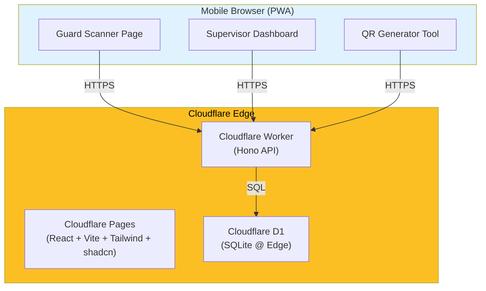
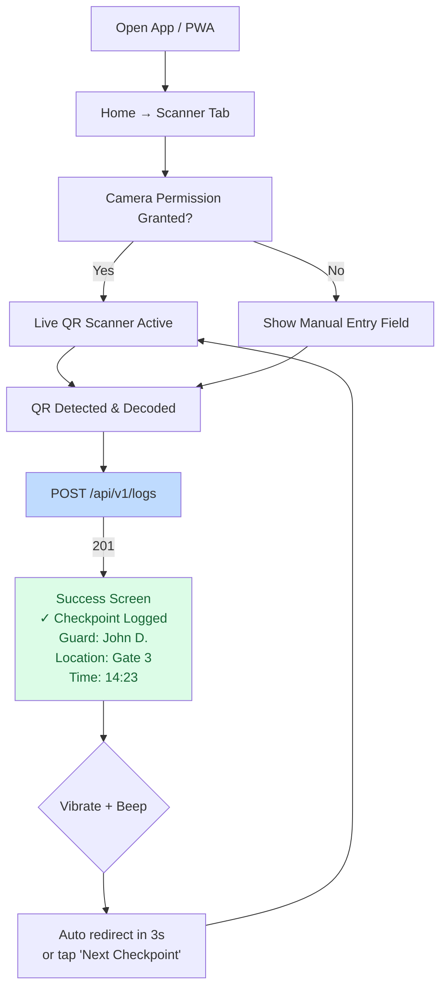
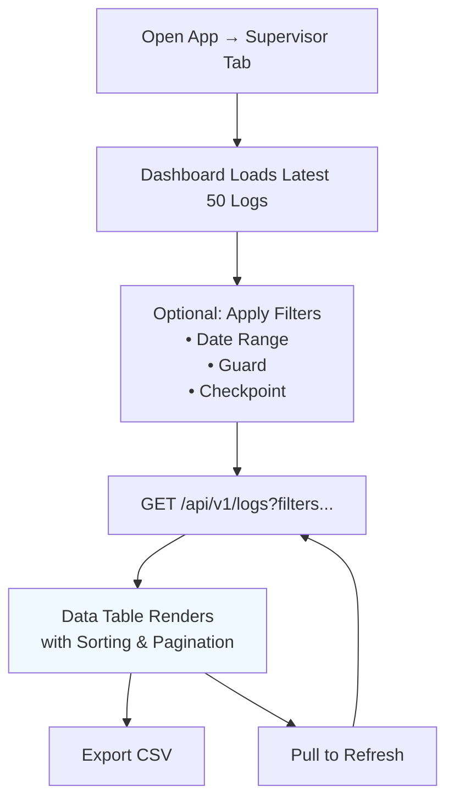
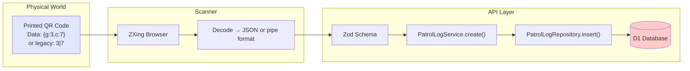
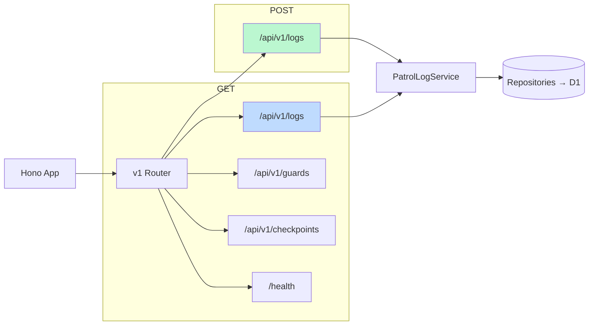
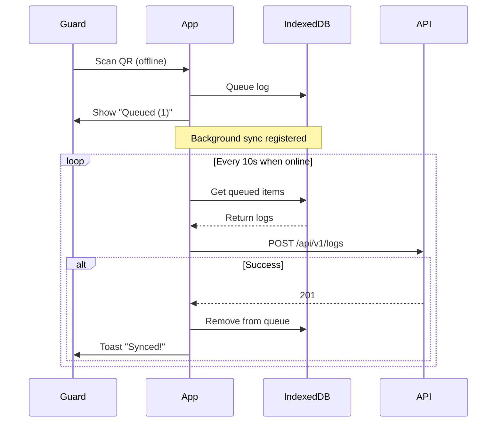
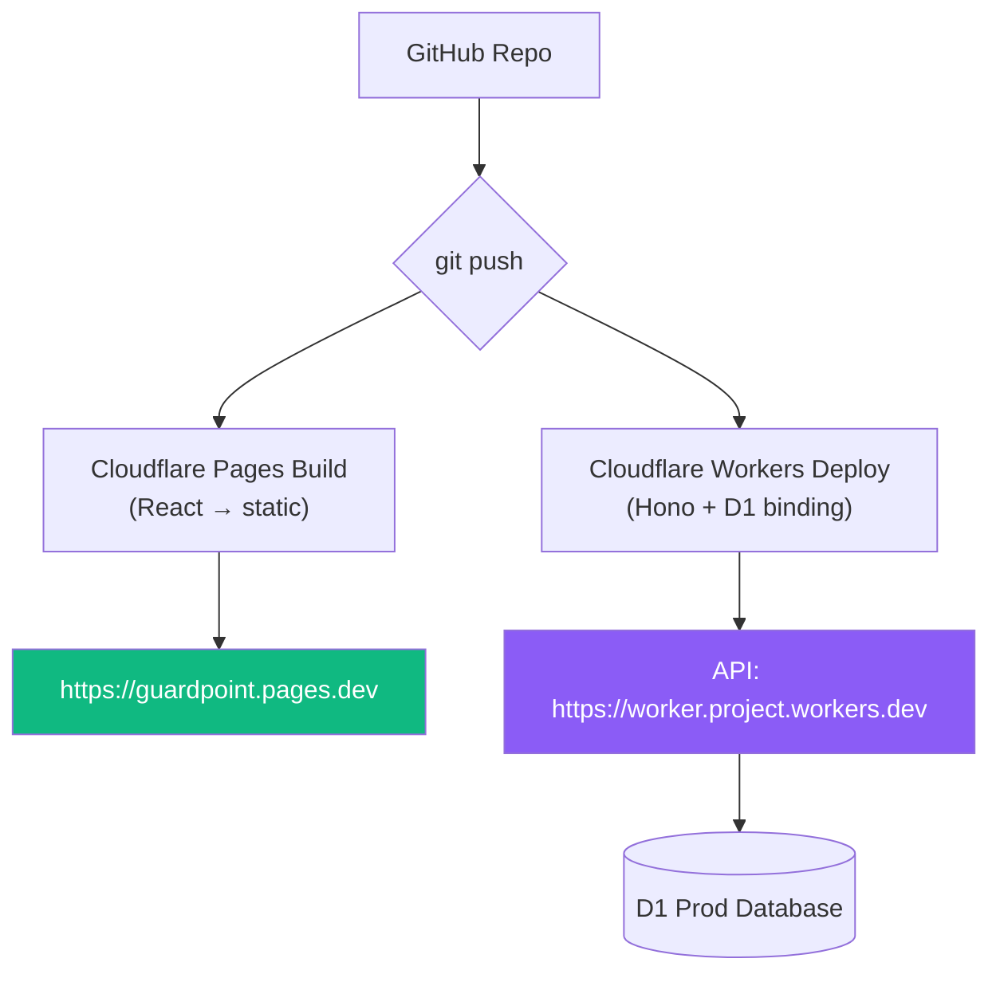

Here’s a complete set of **Mermaid diagrams** that fully describe **GuardPoint** — ready to paste into Markdown, Obsidian, Cursor, or Notion.

### 1. High-Level Product Architecture (C4-style Context + Containers)



### 2. User Flow – Security Guard (Primary Happy Path)



### 3. User Flow – Security Supervisor



### 4. QR Code Data Flow & Format



### 5. Backend API Routes (Hono)



### 6. Folder Structure (Modular & SOLID-compliant)

```bash
src/
├── api/
│   └── routes/v1/
│       ├── logs/
│       │   ├── post-log.ts
│       │   └── get-logs.ts
│       ├── guards.ts
│       └── checkpoints.ts
├── core/
│   ├── repositories/
│   │   ├── PatrolLogRepository.ts
│   │   ├── GuardRepository.ts
│   │   └── CheckpointRepository.ts
│   ├── services/
│   │   └── PatrolLogService.ts
│   └── types/
├── db/
│   ├── d1-client.ts
│   └── schema.ts
├── pages/
│   ├── Scanner.tsx
│   ├── Success.tsx
│   ├── supervisor/Dashboard.tsx
│   └── tools/GenerateQR.tsx
├── components/
│   ├── ui/ (shadcn)
│   ├── ScannerOverlay.tsx
│   └── BottomNav.tsx
└── layouts/MobileLayout.tsx
```

### 7. Offline Queue Flow (Bonus Feature)



### 8. Deployment & CI/CD (Cloudflare)


